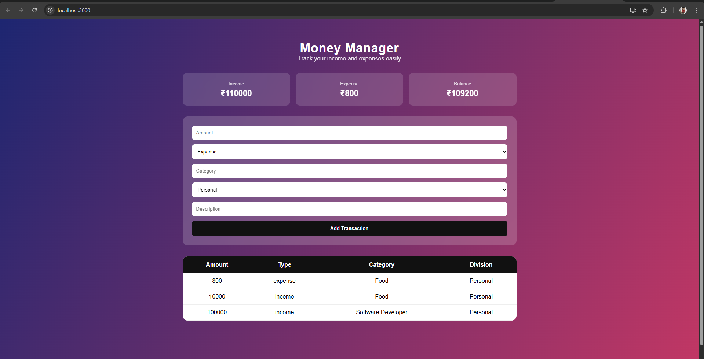

💻 Money Manager – Frontend Application
---

## 📌 Overview
The Money Manager Frontend is a user-friendly web interface developed using React and CSS.  
It allows users to interact with the Money Manager system by viewing, adding, and analyzing financial transactions through an intuitive and responsive UI 🎨📊.

This frontend communicates with a Spring Boot backend via REST APIs to provide real-time financial insights.

---

## 🎯 Problem Statement
Tracking income and expenses using spreadsheets or notes is inconvenient and lacks clarity. Users need a simple, visual, and accessible interface to manage their financial data effectively.

The Money Manager Frontend addresses this problem by offering a clean dashboard-style interface that makes financial tracking easy and understandable 💡.

---

## ✨ Key Features
🧾 View all income and expense transactions  
➕ Add new financial records through the UI  
📊 Display financial summaries (income, expense, balance)  
📅 Filter transactions by date  
🎨 Clean and responsive design  
🔗 Seamless integration with backend REST APIs  

---

## 🛠️ Technology Stack
⚛️ React  
🎨 CSS  
🌐 REST APIs  
🧩 Component-Based Architecture  

---

## 🧱 Application Structure
The frontend follows a component-based structure:

🧩 Components – Reusable UI elements  
📄 Pages – Dashboard and transaction views  
🎨 Styles – Centralized CSS  
🔗 Services – API communication layer  

This structure improves maintainability and scalability 🚀.

---

## 🎨 User Interface Design
The UI focuses on:

✨ Simplicity and clarity  
📱 Responsive layout  
🎯 Easy navigation  

Color grading and spacing enhance user experience while keeping the interface professional.

---

## 🔄 Backend Integration
The frontend consumes REST APIs to:

- Fetch transaction data  
- Submit income and expense entries  
- Display calculated summaries  

All interactions are asynchronous for smooth performance ⚡.

---

## 🧪 Testing & Validation
The frontend was tested by:

- Verifying UI rendering  
- Ensuring correct API data display  
- Validating user inputs  

Backend integration was verified using real-time data.

---

## 🏆 Hackathon Context
This project was developed as part of a hackathon submission 🏁  
The goal was to build a functional and user-friendly application within a limited timeframe ⏳.

---

## 👨‍💻 Author
**Sujeth S**  
🎓 Final Year Computer Science Student  
💻 Frontend Developer (React & CSS)

---

## 📸 Screenshots

### Dashboard

